## Shure Wireless Microphones

This module will connect to the Shure receivers below to provide feedback status as well as some control:

- Shure ULX-D (ULXD4, ULXD4D, ULXD4Q)
- Shure QLX-D (QLXD4)
- Shure SLX-D (SLXD4, SLXD4D)
- Shure SLX-D+ (SLXD4+, SLXD4D+, SLXD4Q+, SLXD4QDAN+)
- Shure Axient Digital (AD4D, AD4Q)

### ⚠️ SLX-D+ pre-flight: enable Controller Access

**SLX-D+ receivers block TCP commands by default.** Before connecting from Companion, on the receiver navigate to:

> `Device Configuration > Device Settings > Controller Access > Allow`

Without this step the device accepts the TCP connection but silently discards every command — no variables update, no actions take effect. (Source: SLXD4Q+ user guide v2.2, page 27.)

### SLX-D+ — presets & encoder

Selecting an SLX-D+ model exposes a preset palette under **SLX-D+ Channel _N_**, **SLX-D+ Channel _N_ (Encoder)** and **SLX-D+ Device**: ready-to-use buttons for status display, link indicator, frequency, battery, gain, encryption, flash, reboot, remote-pair, plus the Dante channel name on SLXD4QDAN+. The encoder preset maps turn = ±1 dB gain, push = reset to 0 dB on Stream Deck Plus / Loupedeck. Full TCP reference: [`docs/SLXDplus-protocol.md`](../docs/SLXDplus-protocol.md).

### SLX-D+ — recommended triggers

The boolean feedbacks below are wired to fire on every state change, so Companion's **Triggers** page can act on them with _"When feedback X becomes true"_:

| Trigger | Condition (feedback to watch) |
| --- | --- |
| **Battery critical** | `Battery Level` with _Battery Alert Level_ = **1** |
| **RF interference** | `Interference Status` on channel _N_ |
| **Transmitter went offline** | `SLX-D+ Slot Link Inactive` on slot _N:1_ |

Wire any Companion action (webhook, page switch, log, flash) underneath. Module API doesn't ship trigger presets yet — you set the condition once per trigger.

### Available actions

| Title                                                         | Model Support               |
| ------------------------------------------------------------- | --------------------------- |
| Set Channel Name x                                 | All                         |
| Mute/Unmute/Toggle Mute of Channel                            | ULX & AD                    |
| Set Audio Gain of Channel x                        | All                         |
| Increase Audio Gain of Channel x                   | All                         |
| Decrease Audio Gain of Channel x                   | All                         |
| Set Frequency of Channel x                         | ULX, QLX, SLX, SLX-D+, & AD |
| Flash Lights on Receiver                                      | ULX, SLX, SLX-D+, AD        |
| Flash Lights on Receiver Channel                              | SLX, SLX-D+, AD             |
| Set slot RF output                                            | ADX only                    |
| Set slot RF power level                                       | ADX only                    |
| SLX-D+: Set Group/Channel                                     | SLX-D+                      |
| SLX-D+: Set channel meter rate                                | SLX-D+                      |
| SLX-D+: Set audio encryption (device)                         | SLX-D+                      |
| SLX-D+: Enable / disable app (Bluetooth) connection           | SLX-D+                      |
| SLX-D+: Remote pairing — enable / disable / accept / reject   | SLX-D+                      |
| SLX-D+: Reboot the linked transmitter                         | SLX-D+                      |
| SLX-D+ (Dante): Set Dante channel name                        | SLXD4QDAN+                  |
| SLX-D+ (Dante): Set network settings (SC / D1 / D2)           | SLXD4QDAN+                  |
| x Dynamic variables can be used with these actions |                             |

### Available feedbacks

| Title                      | Description                                                                                   | Model Support               |
| -------------------------- | --------------------------------------------------------------------------------------------- | --------------------------- |
| Battery Level              | If the battery bar drops to or below a certain value, change the color of the button.         | All                         |
| Channel Frequency          | If the selected channel\'s frequency is set, change the color of the button.                  | ULX, QLX, SLX, SLX-D+, & AD |
| Channel Gain               | If the selected channel\'s gain is set, change the color of the button.                       | All                         |
| Channel Muted              | If the selected channel is muted, change the color of the button.                             | ULX, AD                     |
| Channel Status Display     | **See below**                                                                                 | ULX, QLX, SLX, SLX-D+, & AD |
| Interference Status        | If the selected channel gets interference, change the color of the button.                    | ULX, QLX, SLX-D+, AD        |
| Transmitter Muted          | If the selected channel\'s transmitter is muted, change the color of the button.              | ULX, QLX, & AD              |
| Transmitter Turned Off     | If the selected channel\'s transmitter is powered off, change the color of the button.        | All                         |
| Slot is Active             | If the selected slot\'s transmitter is active to the channel, change the color of the button. | AD                          |
| Slot RF Output             | If the selected slot\'s transmitter RF is set, change the color of the button.                | ADX only                    |
| Slot RF Power              | If the selected slot\'s transmitter power level is set, change the color of the button.       | ADX only                    |
| Slot Status                | If the selected slot\'s status is set, change the color of the button.                        | AD                          |
| SLX-D+ Encryption Error    | True when the channel reports `ENCRYPTION_STATUS = ERROR` (mismatched transmitter).           | SLX-D+                      |
| SLX-D+ Remote-Pair Request | True while a transmitter is advertising itself for BLE remote pairing.                        | SLX-D+                      |
| SLX-D+ Slot Link Active    | True when the side-channel slot reports `LINK_STATUS = online` (TX powered on).               | SLX-D+                      |
| SLX-D+ Slot Link Inactive  | True when the slot reports `LINK_STATUS = offline` with a TX still paired (powered off).      | SLX-D+                      |
| SLX-D+ Slot Empty          | True when no transmitter is paired into the slot.                                             | SLX-D+                      |

### Channel Status Display

The "Channel Status Display" is a customizable feedback to provide a graphic status readout for a channel, similar to information available on the front panel or in Wireless Workbench. On SLX-D+ the renderer shows two RF bars (one per antenna A/B), the audio meter, the battery indicator, and an encryption key icon when audio encryption is on.

| Axient                               | ULX-D                                  | QLX-D                                  | SLX-D                                  | SLX-D+                                         |
| ------------------------------------ | -------------------------------------- | -------------------------------------- | -------------------------------------- | ---------------------------------------------- |
| 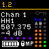 | 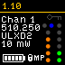 | 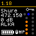 | 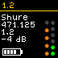 | 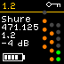 |

#### Setup

To utilize the feedback, you will utilize the "Instance Feedback" section of a button, selecting the "+ Add feedback" option.

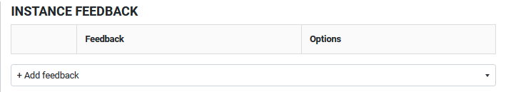

In the dropdown you'll locate the "Channel Status Display" option for your Shure wireless instance.

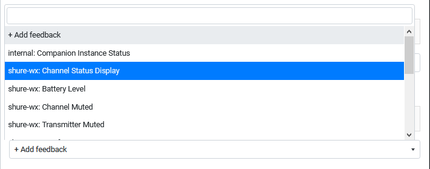

Once added, the feedback will have option to select a channel to display, a field to select text labels to display, a field to select which visual icons should display, and a battery level alert option for the battery icon. A default selection of these options is loaded. Please reference the below tables for further information about them.

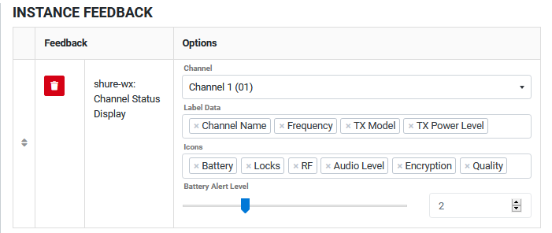

Most of the data that presents is automatically populated from the receiver as information changes, however, a data flow called "metering" is used for the audio and RF data. By default the instance will ask for updates to that data every 5 seconds (5000 ms). In the instance's configuration, metering can be disabled or the interval changed to between 50 and 60000 ms. Because of the graphical nature of this display, additional CPU resources are needed to update the displays timely. For this reason it is recommended to test faster metering intervals with your configuration if you would like the audio and RF displays to update faster. Warning: if the metering interval is too low (fast), you can lock yourself out of the GUI to make changes.

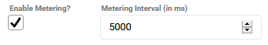

#### Labels

| Title           | Description                                                                                                                              | Model Support  |
| --------------- | ---------------------------------------------------------------------------------------------------------------------------------------- | -------------- |
| Channel Name    | This is the channel's name. 8 characters are supported.                                                                                  | All            |
| TX Device ID    | This is the device ID programmed in the transmitter. Note that for ULX-D and QLX-D, only ULXD6 and ULXD8 models support this field. | ULX, QLX, & AD |
| Frequency       | Displayed as "XXX.XXX"                                                                                                                   | All            |
| Group/Channel   | Displayed as "XX,YY"                                                                                                                     | All            |
| Audio Gain      | Displayed as "+/- X dB"                                                                                                                  | All            |
| TX Model        | Displays the model of the current transmitter or "Unknown" when off.                                                                     | All            |
| TX Power Level  | Displayed as "XX mW" or "Unknown" when off.                                                                                              | ULX, QLX, & AD |
| Battery Type    | Displayed as "LION", "ALKA", "NIMH", "LITH", or "Unknown" when off.                                                                      | ULX, QLX, & AD |
| Battery Runtime | Displayed as "hh:mm" or "Unknown" when off.                                                                                              | All            |

_Labels cannot be re-ordered and will display in the order listed here based on which are selected._

#### Icons

| Title      | Description                                                                                                                                                                                                                        | Model Support  | Examples                                                                                                                                                                          |
| ---------- | ---------------------------------------------------------------------------------------------------------------------------------------------------------------------------------------------------------------------------------- | -------------- | --------------------------------------------------------------------------------------------------------------------------------------------------------------------------------- |
| Audio      | Will display a 6 or 8 segment audio meter on the right edge of the bank.                                                                                                                                                           | All            | 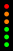 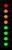                                                                               |
| Battery    | Will display the 5-segment battery indicator in the bottom left of the bank. Based on the "Battery Alert Level" the icon will turn red when the amounts reaches that level. The icon will appear gray when the transmitter is off. | All            |          |
| Encryption | Will display a key icon in the top right of the bank. This will appear white when encyption is enabled, gray when it is disabled, or red when there's an encryption error with the transmitter.                                    | UlX, QLX, & AD |    |
| Locks      | Will display a transmitter lock indication on the bottom of the bank. If a lock is detected the lock icon will be displayed along with an 'M' and/or 'P' to designate Menu and Power locks, repsectively.                          | UlX, QLX, & AD |                                                                                                                                         |
| Quality    | Will display 5-segment quality indicator above the battery and lock icons (if enabled) or along the bottom of the bank.                                                                                                            | AD             |                                                                                                                                  |
| RF         | Will display a RF monitoring block appropriate for the model on the right edge of the bank and inside the audio meter (if enabled).                                                                                                | All            |  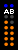                                                                                           |
